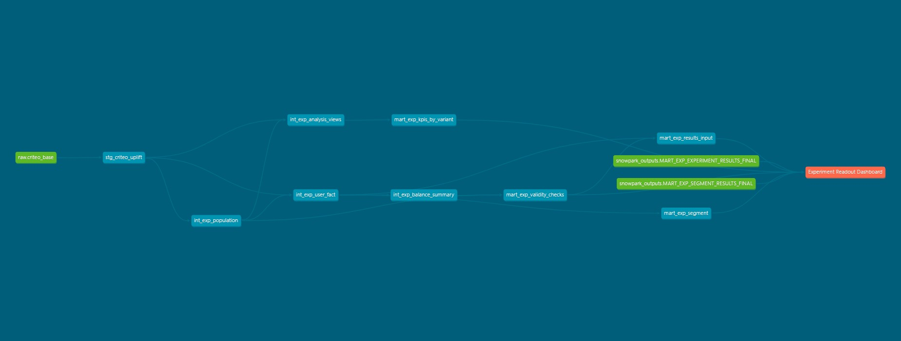
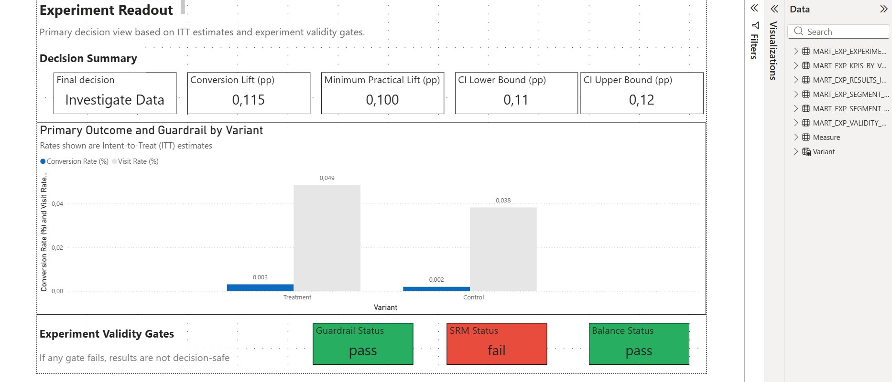
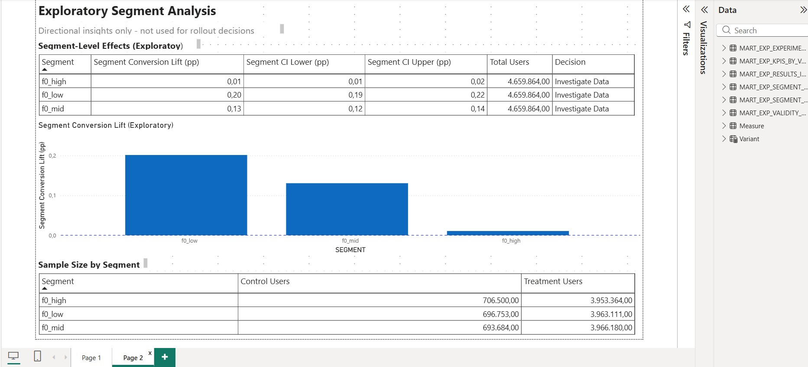

* * *

# 🚀 Incrementality Lab – Growth Experimentation Framework

**End-to-end experimentation workflow** using Snowflake, dbt, Snowpark, and Power BI.

Focus areas: rollout decision logic, guardrail enforcement, practical significance thresholds, and clear separation between experimentation analysis and reporting.

* * *

## 🎯 Project Objective

Design and implement a structured A/B testing framework that supports real rollout decisions.

The goal is not only to compute lift, but to evaluate:

- Is the experiment valid?
    
- Is the observed impact meaningful?
    
- Does it clear predefined business thresholds?
    
- Are core engagement metrics protected?
    

The workflow simulates how a Growth or Product Analytics team would operationalize experimentation at scale.

* * *

## 🧪 Experiment Setup

- **Unit of analysis:** User-level randomized assignment
    
- **Primary KPI:** Conversion rate
    
- **Guardrail:** Visit rate
    
- **Decision metric:** Intent-to-Treat (ITT)
    

Two analytical views are modeled:

- **ITT (rollout-authoritative)**
    
- **Exposure view (diagnostic only)**
    

Rollout decisions rely strictly on ITT to preserve causal interpretation.

* * *

## 🔒 Decision Framework

The experiment passes through sequential gates:

### 1\. Validity Checks

- Sample Ratio Mismatch (SRM)
    
- Pre-treatment balance across features (f0–f11)
    

Failure at this stage results in investigation before interpretation.

* * *

### 2\. Guardrail Evaluation

Visit rate must not decline beyond a predefined threshold.

This prevents growth at the expense of engagement.

* * *

### 3\. Practical Significance

Observed lift must exceed a **Minimum Practical Lift (MPL)**.

Large sample sizes can produce statistically detectable but operationally irrelevant effects. MPL prevents shipping negligible changes.

* * *

### 4\. Confidence Threshold

The lower bound of the 95% confidence interval must exceed MPL.

This adds a risk-aware buffer to rollout decisions.

* * *

### Possible Outcomes

- `ROLL_OUT`
    
- `DO_NOT_ROLL_OUT`
    
- `RUN_FOLLOWUP`
    
- `INVESTIGATE_DATA`
    

* * *

## 📊 Exploratory Segmentation

Segment-level analysis is included for hypothesis generation.

- Quantile-based engagement segments
    
- Segment lift and confidence intervals
    
- Explicit exploratory labeling
    

Segment findings do not override rollout decisions.

* * *

# 🧩 Architecture Overview

```
Raw Data → dbt Modeling → Snowpark Inference → Power BI Dashboard
```

The project separates transformation, inference, and visualization responsibilities.

* * *

## 🗄️ Snowflake + dbt (Modeling Layer)

warehouse: `abtest` 
Database: `AB_DB`  
Schemas: `RAW`, `ANALYTICS`  

### Staging

- Type normalization and schema enforcement

### Intermediate

- Experiment population definition
    
- ITT vs exposure views
    
- Feature balance summary
    
- User-level fact model
    

### Marts

- Variant-level KPIs
    
- Validity checks
    
- Inference input contracts
    
- Segment input contracts
    

### dbt Lineage

Generated via `dbt docs generate`:



The DAG documents dependencies from source tables through marts and dashboard exposure.

* * *

## 🧠 Snowpark (Inference Layer)

Snowpark Python (Worksheets) computes:

- Difference in proportions (ITT)
    
- Standard error
    
- 95% confidence intervals
    
- Absolute and relative lift
    
- Guardrail lift
    
- Decision classification
    

Outputs:

- `MART_EXP_EXPERIMENT_RESULTS_FINAL`
    
- `MART_EXP_SEGMENT_RESULTS_FINAL`
    

All decision logic is centralized upstream rather than computed in BI.

* * *

## 📈 Power BI Dashboard

Two-page structure:

### 1 – Experiment Readout



Includes:

- Final decision
    
- Lift (pp)
    
- CI bounds
    
- MPL comparison
    
- Guardrail status
    
- Validity gates
    

* * *

### 2 – Segment Analysis



Includes:

- Segment-level lift
    
- Confidence intervals
    
- Sample size context
    
- Zero-lift reference line
    

The dashboard consumes Snowflake outputs directly. DAX is limited to presentation-level calculations.

* * *

# 🛠️ Tech Stack

- **Snowflake** (Free Edition)
    
- **dbt**
    
- **Snowpark Python**
    
- **Python 3.11**
    
- **NumPy / SciPy / Pandas**
    
- **Power BI 2026**
    
- **Git**
    

* * *

# 📁 Repository Structure

```text
criteo_ab/        # dbt models (staging, intermediate, marts, exposures)
snowpark/         # Statistical inference scripts
snowflake/        # Warehouse setup & validation SQL
dashboard/        # Power BI files
images/           # DAG and dashboard screenshots
notebooks/        # Data extraction
```

* * *

## 🏷️ Versioning

| Version | Description |
| --- | --- |
| v0.1.0 | dbt setup + staging models |
| v0.2.0 | intermediate experiment analysis layer |
| v0.3.0 | decision input and validity marts |
| v0.3.1 | dbt docs exposure + DAG |
| v0.4.0 | snowpark hypothesis testing and decisioning |
| v0.4.1 | snowflake validation checks |

* * *

## 👤 Author

Ragha (Analytics Engineering & BI) | Berlin, Germany

* * *

&nbsp;
